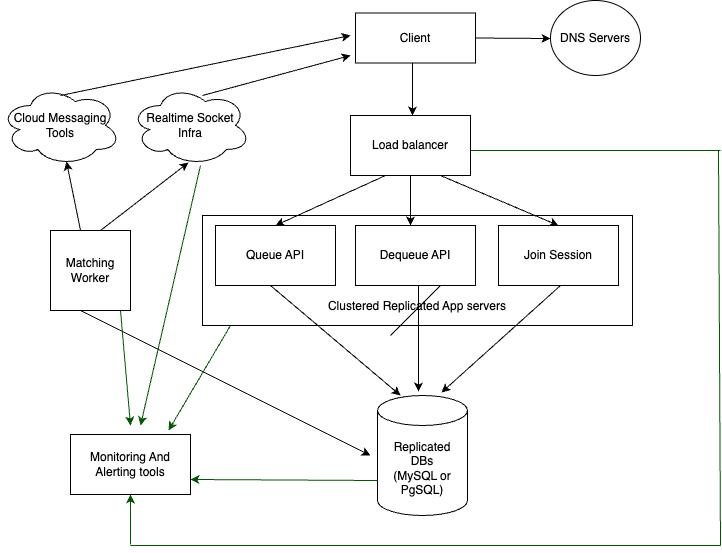

# Assumptions

I have made the following assumptions:
- I have designed this service to be invoked internally by other services, making it safe to call methods like QueuePlayer using the PlayerId provided in the REST API. However, if the service is exposed to external users, we should implement authentication mechanisms and avoid accepting PlayerId directly from the request body to ensure security.
- I defined something named QueuedPlayer as another entity in table, because I have considered that Player is something from another microservice and since I wanted to add some new fields to it, I considered a QueuedPlayer entity which can be casted to player and vice versa.
- **Session Definition:** A session is a competitive environment where 2 to 10 players can participate. A player can only be part of one session at a time until it concludes.
- **Session Joining:** Players must either leave their current contest or wait for it to finish before joining a new session.
- **Session Timing:** A session begins at a specified timestamp if at least two players are available and ends after a pre-determined duration from the start time.
- **Error Handling:** The `QueuePlayerAsync` method may occasionally return errors. Therefore, I have modified the interface response to `Task<IActionResult>` to handle these errors effectively.
- **Process Flow:**
  - A player requests to join a contest session.
  - If the player is not currently in an active session, their request is placed in a queue.
  - A worker process periodically checks the queue, matches players, creates new sessions, and notifies players about the start of their contest.
  - **Optional Implementation:** If there is an active session that meets the player's criteria, they can join it. Otherwise, their request will be queued (this feature is not implemented).

## Why Use Asynchronous Matching?

If a session were created for every request and returned in the response, the system would need to check all database records to find a suitable match, which also could lead to unnecessary session creation if we want to speed up the response time by passing some condition checkings in database. This approach requires handling `mutual exclusion` for every request. As processing each request takes time, this architecture can result in poor response times and potential deadlocks if not implemented carefully.

To address these issues, I've considered:

- **Session Creation:** Sessions are not created via the API but only through a scheduled console command (cron job).
- **Cron Job Execution:** A matching cron job can be scheduled to run every minute. Since only one instance of this job executes at a time, mutual exclusion and concurrency management are unnecessary as long as this condition is upheld. Alternatively, we can implement a worker that continuously performs the matching operation in a `while(true)` loop, if the one-minute interval is not optimal for user experience.
- **Efficient Matching:** This approach ensures efficient matching and prevents the creation of unnecessary sessions through a well-implemented matching command.

//TODO: desc more about why if we respond back the session_id what would be challenges.
# Database Schema
### Sessions Table

| Column Name   | Data Type    | Constraints           | Description                     |
|---------------|--------------|-----------------------|---------------------------------|
| `Id`          | `UUID`       | `PRIMARY KEY`         | Unique identifier for each session |
| `LatencyLevel`  | `INT`        | `CHECK(LatencyLevel >= 1)` | Latency level of the player (1 to 5) |
| `JoinedCount`  | `INT`        | `DEFAULT 0 CHECK(JoinedCount <= 10)` | Number of players joined the session |
| `CreatedAt`   | `DATETIME`   | `DEFAULT CURRENT_TIMESTAMP` | Timestamp when the record was created |
| `StartsAt`   | `DATETIME`   | `` | Timestamp when the contest will start |
| `EndsAt`   | `DATETIME`   | `` | Timestamp when the contest will end |

### Sessions_Players Table
Relation of Players and Sessions

| Column Name  | Data Type                     | Constraints                                 | Description                                   |
|--------------|-------------------------------|---------------------------------------------|-----------------------------------------------|
| `Id`         | `UUID`                        | `PRIMARY KEY`                               | Unique identifier for each session            |
| `Session_id` | `UUID`                        | `NOT NULL`                                  | ID of the session the player is attending     |
| `Player_id`  | `UUID`                        | `NOT NULL`                                  | ID of the player attending the session        |
| `Status`     | `ENUM('ATTENDED','PLAYED','LEFT')` | `DEFAULT 'ATTENDED'`                         | Status of the player in the session           |
| `Score`      | `INT`                         | `DEFAULT 0`                                 | Score of the player in the contest            |
| `CreatedAt`  | `DATETIME`                    | `DEFAULT CURRENT_TIMESTAMP`                 | Timestamp when the record was created         |
| `UpdatedAt`  | `DATETIME`                    | `DEFAULT CURRENT_TIMESTAMP ON UPDATE CURRENT_TIMESTAMP` | Timestamp when the record was last updated    |

## Queued_Players Table

This table contains players' requests to join a session.

| Column Name   | Data Type  | Constraints                             | Description                                             |
|---------------|------------|-----------------------------------------|---------------------------------------------------------|
| `Id`          | `UUID`     | `PRIMARY KEY`                           | Unique identifier for each request                      |
| `Player_id`   | `UUID`     | `UNIQUE`                                | ID of the player requesting to join a session           |
| `LatencyLevel`| `INT`      | `CHECK(LatencyLevel >= 1 AND LatencyLevel <= 5)` | Latency level of the player (1 to 5, where 1 is best)   |
| `CreatedAt`   | `DATETIME` | `DEFAULT CURRENT_TIMESTAMP`             | Timestamp when the request was created                  |

# Code Design and Architecture
There are 3 APIs:
- Queue: Allows players to request entry into the queue, provided they haven't already done so.
- Dequeue: Enables players to cancel their matchmaking request.
- Join Session: Once a player has been matched and received their sessionId via push notification or WebSocket, they can use this API to join their contest session.

# Diagrams
