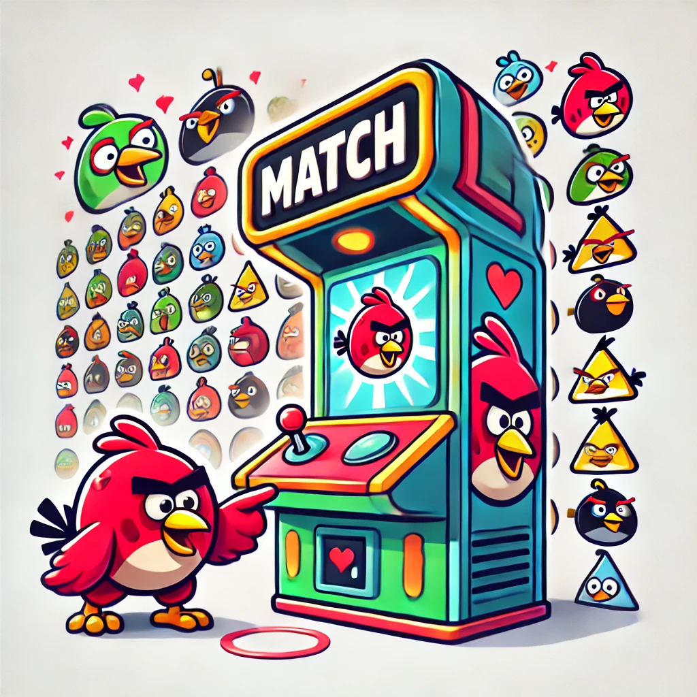
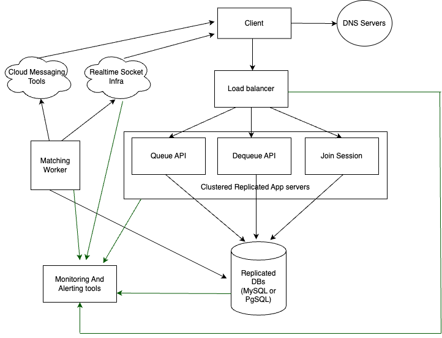

# Assumptions

I have made the following assumptions:

- I have designed this service to be invoked internally by other services, making it safe to call methods like QueuePlayer using the PlayerId provided in the REST API. However, if the service is exposed to external users, we should implement authentication mechanisms and avoid accepting PlayerId directly from the request body to ensure security.
- I defined something named QueuedPlayer as another entity in table, because I have considered that Player is something from another microservice and since I wanted to add some new fields to it, I considered a QueuedPlayer entity which can be casted to player and vice versa.
- **Session Definition:** A session is a competitive environment where 2 to 10 players can participate. A player can only be part of one session at a time until it concludes.
- **Session Joining:** Players must either leave their current contest or wait for it to finish before joining a new session.
- **Session Timing:** A session begins at a specified timestamp if at least two players are available and ends after a pre-determined duration from the start time.
- **Error Handling:** The `QueuePlayerAsync` method may occasionally return errors. Therefore, I have modified the interface response to `Task<IActionResult>` to handle these errors effectively.
- **Process Flow:**
  - A player requests to join a contest session.
  - If the player is not currently in an active session, their request is placed in a queue.
  - A worker process periodically checks the queue, matches players, creates new sessions, and notifies players about the start of their contest.
  - **Optional Implementation:** If there is an active session that meets the player's criteria, they can join it. Otherwise, their request will be queued (this feature is not implemented).

## Why Use Asynchronous Matching?

If a session were created for every request and returned in the response, the system would need to check all database records to find a suitable match, which also could lead to unnecessary session creation if we want to speed up the response time by passing some condition checkings in database. This approach requires handling `mutual exclusion` for every request. As processing each request takes time, this architecture can result in poor response times and potential deadlocks if not implemented carefully.

To address these issues, I've considered:

- **Session Creation:** Sessions are not created via the API but only through a scheduled console command (cron job).
- **Cron Job Execution:** A matching cron job can be scheduled to run every minute. Since only one instance of this job executes at a time, mutual exclusion and concurrency management are unnecessary as long as this condition is upheld. Alternatively, we can implement a worker that continuously performs the matching operation in a `while(true)` loop, if the one-minute interval is not optimal for user experience.
- **Efficient Matching:** This approach ensures efficient matching and prevents the creation of unnecessary sessions through a well-implemented matching command.

# Database Schema

### Sessions Table

| Column Name   | Data Type    | Constraints           | Description                     |
|---------------|--------------|-----------------------|---------------------------------|
| `Id`          | `UUID`       | `PRIMARY KEY`         | Unique identifier for each session |
| `LatencyLevel`  | `INT`        | `CHECK(LatencyLevel >= 1)` | Latency level of the player (1 to 5) |
| `JoinedCount`  | `INT`        | `DEFAULT 0 CHECK(JoinedCount <= 10)` | Number of players joined the session |
| `CreatedAt`   | `DATETIME`   | `DEFAULT CURRENT_TIMESTAMP` | Timestamp when the record was created |
| `StartsAt`   | `DATETIME`   | `` | Timestamp when the contest will start |
| `EndsAt`   | `DATETIME`   | `` | Timestamp when the contest will end |

### Sessions_Players Table

Relation of Players and Sessions

| Column Name  | Data Type                     | Constraints                                 | Description                                   |
|--------------|-------------------------------|---------------------------------------------|-----------------------------------------------|
| `Id`         | `UUID`                        | `PRIMARY KEY`                               | Unique identifier for each session            |
| `Session_id` | `UUID`                        | `NOT NULL`                                  | ID of the session the player is attending     |
| `Player_id`  | `UUID`                        | `NOT NULL`                                  | ID of the player attending the session        |
| `Status`     | `ENUM('ATTENDED','PLAYED','LEFT')` | `DEFAULT 'ATTENDED'`                         | Status of the player in the session           |
| `Score`      | `INT`                         | `DEFAULT 0`                                 | Score of the player in the contest            |
| `CreatedAt`  | `DATETIME`                    | `DEFAULT CURRENT_TIMESTAMP`                 | Timestamp when the record was created         |
| `UpdatedAt`  | `DATETIME`                    | `DEFAULT CURRENT_TIMESTAMP ON UPDATE CURRENT_TIMESTAMP` | Timestamp when the record was last updated    |

## Queued_Players Table

This table contains players' requests to join a session.

| Column Name   | Data Type  | Constraints                             | Description                                             |
|---------------|------------|-----------------------------------------|---------------------------------------------------------|
| `Id`          | `UUID`     | `PRIMARY KEY`                           | Unique identifier for each request                      |
| `Player_id`   | `UUID`     | `UNIQUE`                                | ID of the player requesting to join a session           |
| `LatencyLevel`| `INT`      | `CHECK(LatencyLevel >= 1 AND LatencyLevel <= 5)` | Latency level of the player (1 to 5, where 1 is best)   |
| `CreatedAt`   | `DATETIME` | `DEFAULT CURRENT_TIMESTAMP`             | Timestamp when the request was created                  |

# Code Design and Architecture

## APIs

1. **Queue**: Allows players to request entry into the matchmaking queue, provided they haven't already joined.
2. **Dequeue**: Enables players to cancel their matchmaking request.
3. **Join Session**: Once a player has been matched and receives their `sessionId` via push notification or WebSocket, they can use this API to join their contest session.

## System Workflow

1. Players initiate a matchmaking request through the `queue` API.
2. Players can cancel their request by calling the `dequeue` API.
3. A worker process, running in the `Rovio.MatchMaking.Console` command-line tool, is responsible for matching players.

   - The worker first retrieves active sessions with fewer than 10 players.
   - It then attempts to assign players to these sessions based on their latency level, ensuring they join sessions within acceptable latency thresholds.

## Latency Levels

Latency is categorized as follows:

- **Level 1**: ≤ 100ms
- **Level 2**: > 100ms and ≤ 200ms
- **Level 3**: > 200ms and ≤ 300ms
- **Level 4**: > 300ms and ≤ 400ms
- **Level 5**: > 400ms


# System Design Diagram of Matchmaking service



# How to run project

## Initial Setup

### 1. Database Configuration
- Ensure that your database connections are configured correctly:
  1. Install a fresh MySQL database and obtain its credentials. You can use a Dockerized version of MySQL.
  2. Update the database configurations in the following files:
     - `Rovio.MatchMaking.Repositories/appsettings.json`
     - `Rovio.MatchMaking.Repositories/appsettings.Development.json`
     - `Rovio.MatchMaking.Net/appsettings.json`
     - `Rovio.MatchMaking.Net/appsettings.Development.json`

### 2. Installing Infrastructure
- Navigate to the `Rovio.MatchMaking.Repositories` directory and run the following command to set up the infrastructure:

    ```bash
    dotnet ef database update --context AppDbContext
    ```

### 3. Installing Dependencies
- Install the necessary dependencies by running:

    ```bash
    dotnet restore
    ```

### 4. Running the Project
- Build and run the project using the following commands:

    ```bash
    dotnet build
    dotnet run
    ```

- Start the `Rovio.MatchMaking.Net` module by executing the `dotnet run` command at the root of the project. 
- Once running, you can access the `Swagger Panel` and use the `queue` API multiple times to queue different users with varying latencies.

### 5. Running the Matchmaking Worker
- To match users, navigate to the `Rovio.MatchMaking.Console` project and run the following command:

    ```bash
    dotnet run
    ```

- This will initiate the matchmaking worker and execute the matchmaking operations. After execution, verify the following in the database:
  - Players queued for matching should be removed from the `QueuedPlayers` table.
  - New sessions should be created in the `Sessions` table.
  - The `SessionPlayers` table should reflect the players assigned to sessions based on their latencies.

### 6. Client Notification and Session Joining
- After matching, clients (users) will be notified of their session assignment via FCM or WebSocket, receiving their `session_id`.
- They can then call the `match/join` API to obtain session data and view their teammates (competitors list).

# How to deploy on production and how to scale
## Production Deployment Strategy

To deploy the system into production, it is recommended to Dockerize the `Rovio.MatchMaking.Net` and `Rovio.MatchMaking.Console` modules. Using a container orchestration tool like Kubernetes, you can manage deployments efficiently on platforms such as Google Kubernetes Engine (GKE), Amazon EKS, or Azure Kubernetes Service (AKS).

### Deployment Plan

1. **Deploying `Rovio.MatchMaking.Net`:**
   - Set up `Rovio.MatchMaking.Net` as a Kubernetes deployment.
   - Configure it to scale based on demand, either manually or using an autoscaler to dynamically adjust resources according to the load.

2. **Deploying the Matchmaking Worker (`Rovio.MatchMaking.Console`):**
   - Deploy the `Rovio.MatchMaking.Console` module as a single-pod deployment.
   - Integrate health checks and monitoring tools to ensure the worker restarts or scales as needed.
   - Consider using a message queuing system like RabbitMQ or Redis to manage matchmaking tasks. This will allow multiple instances of the matchmaking worker to operate concurrently without race conditions, overcoming the limitations of the current single-instance model.

3. **Database Configuration:**
   - A single-node instance should be sufficient for the database, but performance can be enhanced with the following optimizations:
     - Implement table partitioning.
     - Define efficient indexing strategies.
     - Use sharding if necessary (although it is unlikely to be needed even under high loads).
     - Regularly archive and move old data to cold storage to maintain performance and manage database size.

By following this strategy, the system can handle high loads efficiently, ensure resilience, and provide seamless scalability in a production environment.

# Tests
Tests are developed for the following modules:
- `Rovio.MatchMaking.Net`
- `Rovio.MatchMaking.Console`
To run the tests, you can simply run the following cmd from root of the project:
```
dotnet test
```